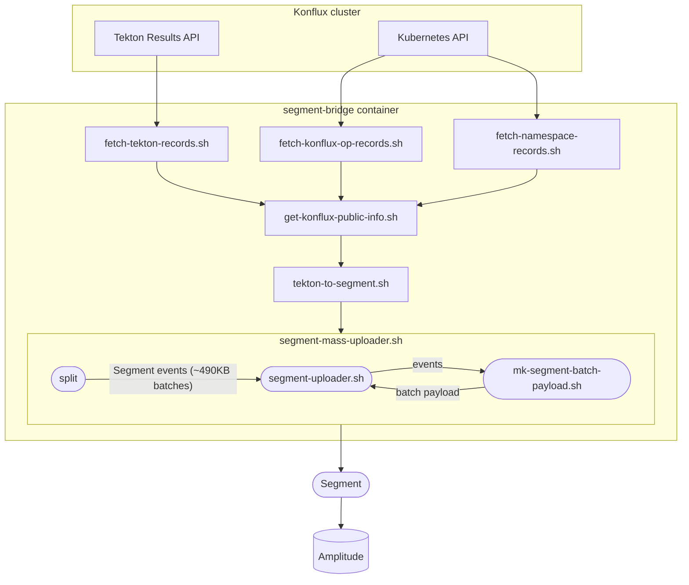

# segment-bridge

Bridge anonymous [Tekton](https://tekton.dev/) PipelineRun telemetry from Konflux
clusters into [Segment][1] (and downstream analytics such as Amplitude).

**Note:** If you cannot see the drawing above in GitHub, make sure you are not
blocking JavaScript from *viewscreen.githubusercontent.com*.

The container entrypoint [`tekton-main-job.sh`](scripts/tekton-main-job.sh)
orchestrates: fetch PipelineRun records and related cluster context, enrich with
public Konflux metadata, map to Segment batch events, then upload in chunks.
See the [`Dockerfile`](Dockerfile) for the image layout and typical environment
variables.

## Deployment

Kubernetes manifests live under [`config/`](config/) (Kustomize base). The CronJob
uses the published image default entrypoint (no `command` override), so the
Tekton pipeline runs automatically.

[1]: https://app.segment.com

Segment has a [built-in mechanism for removing duplicate events][ES1]. This
means we can safely resend the same event multiple times to increase delivery
reliability. The mechanism uses the `messageId` [common message field][ES2].

Segment also has a [*batch* call][ES3] that allows sending multiple events in
one request. There is a limit of 500KB per call; individual event JSON records
should not exceed 32KB.

The uploader splits the stream into ~500KB chunks and retries failed batch
calls (configurable, default three attempts).

[ES1]: https://segment.com/blog/exactly-once-delivery/
[ES2]: https://segment.com/docs/connections/spec/common/
[ES3]: https://segment.com/docs/connections/sources/catalog/libraries/server/http-api/#batch

## Contributing

Please refer to the [contribution guide](./CONTRIBUTING.md).
