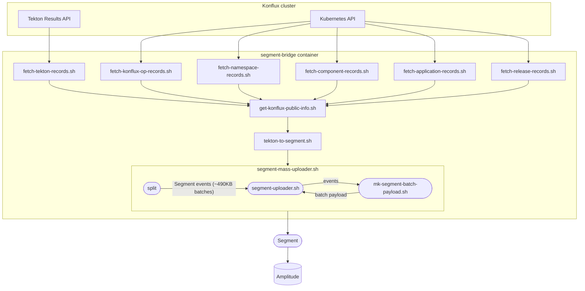

# segment-bridge

Bridge anonymous [Tekton](https://tekton.dev/) PipelineRun telemetry from Konflux
clusters into [Segment][1] (and downstream analytics such as Amplitude).


```mermaid
flowchart TB
    subgraph A["Konflux cluster"]
        A1["Tekton Results API"]
        A2["Kubernetes API"]
    end

    subgraph B["segment-bridge container"]
        B1["fetch-tekton-records.sh"]
        B1b["fetch-konflux-op-records.sh"]
        B1c["fetch-namespace-records.sh"]
        B1d["fetch-component-records.sh"]
        B1e["fetch-application-records.sh"]
        B1f["fetch-release-records.sh"]
        B2["get-konflux-public-info.sh"]
        B3["tekton-to-segment.sh"]
        subgraph B4["segment-mass-uploader.sh"]
            B4C([split])
            B4A([segment-uploader.sh])
            B4B([mk-segment-batch-payload.sh])
            B4C--"Segment events (~490KB batches)"-->B4A
            B4A--"events"-->B4B--"batch payload"-->B4A
        end
        B1 --> B2
        B1b --> B2
        B1c --> B2
        B1d --> B2
        B1e --> B2
        B1f --> B2
        B2 --> B3
        B3 --> B4
    end

    A1 --> B1
    A2 --> B1b
    A2 --> B1c
    A2 --> B1d
    A2 --> B1e
    A2 --> B1f

    G([Segment])
    H[(Amplitude)]
    B4 --> G --> H
```

**Note:** If you cannot see the drawing above in GitHub, make sure you are not
blocking JavaScript from *viewscreen.githubusercontent.com*.

The container entrypoint [`tekton-main-job.sh`](scripts/tekton-main-job.sh)
orchestrates: fetch PipelineRun records and related cluster context, enrich with
public Konflux metadata, map to Segment batch events, then upload in chunks.

## Quick Start

```bash
make setup   # install toolchain (mise), pre-commit hooks
make test    # run all Go tests
make lint    # golangci-lint
```

See [CONTRIBUTING.md](CONTRIBUTING.md) for the full development guide.

## Installation

**Prerequisites:**

- [mise](https://mise.jdx.dev/) (installs Go, kubectl, oc, Python automatically)
- [Podman](https://podman.io/) (for building/running the container image)
- curl, jq (typically pre-installed on Linux/macOS)

**Setup from a fresh clone:**

```bash
git clone https://github.com/konflux-ci/segment-bridge.git
cd segment-bridge
make setup
```

`make setup` installs all pinned tool versions via mise and configures
pre-commit hooks. Run `make help` to see all available targets.

## Usage

**Build and run the container image locally:**

```bash
# Prepare the OpenShift client tarball (one-time)
./scripts/prepare-oc-client-for-build.sh

# Build the image
podman build -v "$(pwd)/deps:/cachi2/output/deps:Z" -t segment-bridge .

# Run (adjust env vars for your cluster)
podman run --rm \
  -e TEKTON_RESULTS_API_ADDR=https://tekton-results-api-service:8443 \
  -e TEKTON_NAMESPACE=default \
  -e TEKTON_RESULTS_TOKEN="$(kubectl create token default -n default)" \
  -e SEGMENT_WRITE_KEY=your-write-key \
  segment-bridge
```

Fetch uses the Tekton Results HTTP REST API (not the `tkn-results` gRPC
CLI). If you previously set `TEKTON_RESULTS_API_ADDR` to a gRPC endpoint
(`*:50051`), update it to the HTTPS REST endpoint (typically `:8443`).

See the [`Dockerfile`](Dockerfile) header for additional usage examples.

## Environment variables

| Variable | Default | Used by | Description |
|----------|---------|---------|-------------|
| `TEKTON_RESULTS_API_ADDR` | `https://localhost:8443` | `fetch-tekton-records.sh` | Tekton Results HTTP REST API base URL (include `http://` or `https://`) |
| `TEKTON_RESULTS_TOKEN` | *(empty)* | `fetch-tekton-records.sh` | Bearer token for the Results API; when unset, read from `SA_TOKEN_PATH` |
| `SA_TOKEN_PATH` | `/var/run/secrets/kubernetes.io/serviceaccount/token` | `fetch-tekton-records.sh` | Service account token file used when `TEKTON_RESULTS_TOKEN` is unset |
| `TEKTON_NAMESPACE` | `-` (all namespaces) | `fetch-tekton-records.sh` | Namespace passed to the Results API parent path |
| `TEKTON_LIMIT` | `100` | `fetch-tekton-records.sh` | Maximum PipelineRun records fetched per API page |
| `TEKTON_MAX_PAGES` | `100` | `fetch-tekton-records.sh` | Maximum pages before pagination stops |
| `TEKTON_CURSOR` | *(none)* | `fetch-tekton-records.sh` | Override create_time cursor (RFC3339); skips ConfigMap read when set |
| `TEKTON_CURSOR_CONFIGMAP` | `segment-bridge-cursor` | `fetch-tekton-records.sh` | ConfigMap name for cursor persistence between runs |
| `TEKTON_CURSOR_NAMESPACE` | `segment-bridge` | `fetch-tekton-records.sh` | Namespace of the cursor ConfigMap |
| `KUBECTL` | auto (`kubectl`, then `oc`) | fetch/get scripts | Kubernetes CLI; set to empty string to disable auto-detection in `fetch-tekton-records.sh` |
| `NAMESPACE_RECENT_HOURS` | `4` | `fetch-namespace-records.sh` | Only emit tenant namespaces created or updated within this many hours |
| `COMPONENT_RECENT_HOURS` | `4` | `fetch-component-records.sh` | Only emit AppStudio Components created or updated within this many hours |
| `APPLICATION_RECENT_HOURS` | `4` | `fetch-application-records.sh` | Only emit AppStudio Applications created or updated within this many hours |
| `RELEASE_RECENT_HOURS` | `4` | `fetch-release-records.sh` | Only emit AppStudio Releases created or updated within this many hours |
| `CLUSTER_ID` | `anonymous` | `get-konflux-public-info.sh`, `tekton-to-segment.sh` | Salt for anonymized hashes; auto-resolved from cluster when unset (see `get-konflux-public-info.sh`) |
| `KONFLUX_VERSION` | *(auto)* | `tekton-to-segment.sh` | Optional Konflux version property on Segment events |
| `KUBERNETES_VERSION` | *(auto)* | `tekton-to-segment.sh` | Optional Kubernetes version property on Segment events |
| `SEGMENT_WRITE_KEY` | *(none)* | `tekton-main-job.sh` | Segment write key; when set, a temporary `.netrc` is generated for upload |
| `SEGMENT_BATCH_API` | `https://api.segment.io/v1/batch` | `segment-uploader.sh`, `tekton-main-job.sh` | Segment batch API URL (direct or proxy) |
| `CURL_NETRC` | `$HOME/.netrc` | `segment-uploader.sh` | Netrc file for HTTP Basic auth (overridden when `SEGMENT_WRITE_KEY` is set) |
| `SEGMENT_RETRIES` | `3` | `segment-uploader.sh` | Number of upload retries on failure |
| `SEGMENT_BATCH_DATA_SIZE` | `501760` (490 KiB) | `segment-mass-uploader.sh` | Maximum bytes per upload batch |
| `HEARTBEAT_TIMESTAMP` | current UTC time | `tekton-to-segment.sh` | RFC3339 timestamp for the heartbeat event |

Integration test variables (`SEGMENT_BRIDGE_TEST_IMAGE`,
`SEGMENT_BRIDGE_TEST_CONTAINER_RUNTIME`) are documented in
[CONTRIBUTING.md](CONTRIBUTING.md). Test time overrides `NAMESPACE_NOW_ISO`,
`COMPONENT_NOW_ISO`, `APPLICATION_NOW_ISO` and `RELEASE_NOW_ISO` are documented
in script headers for `fetch-namespace-records.sh`, `fetch-component-records.sh`,
`fetch-application-records.sh` and `fetch-release-records.sh`.

## Deployment

- Kubernetes manifests: [`config/`](config/) (Kustomize base)
- The CronJob runs the published image entrypoint automatically
- Requires a `segment-bridge-config` Secret with `SEGMENT_WRITE_KEY`
  (Secret is `optional: true` — pod starts without it, but uploads are skipped)
- Segment [deduplicates events][ES1] via `messageId`, so resending is safe
- The uploader splits into ~500 KB [batch calls][ES3] and retries failures

Create the Secret:

```yaml
apiVersion: v1
kind: Secret
metadata:
  name: segment-bridge-config
  namespace: segment-bridge
stringData:
  SEGMENT_WRITE_KEY: "<your-segment-write-key>"
```

[1]: https://app.segment.com
[ES1]: https://segment.com/blog/exactly-once-delivery/
[ES3]: https://segment.com/docs/connections/sources/catalog/libraries/server/http-api/#batch

## Contributing

Please refer to the [contribution guide](./CONTRIBUTING.md).
